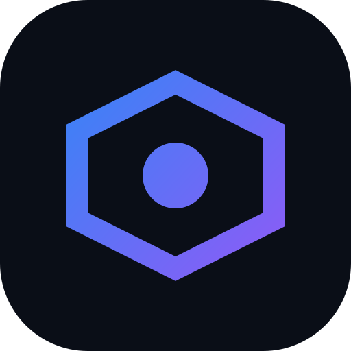
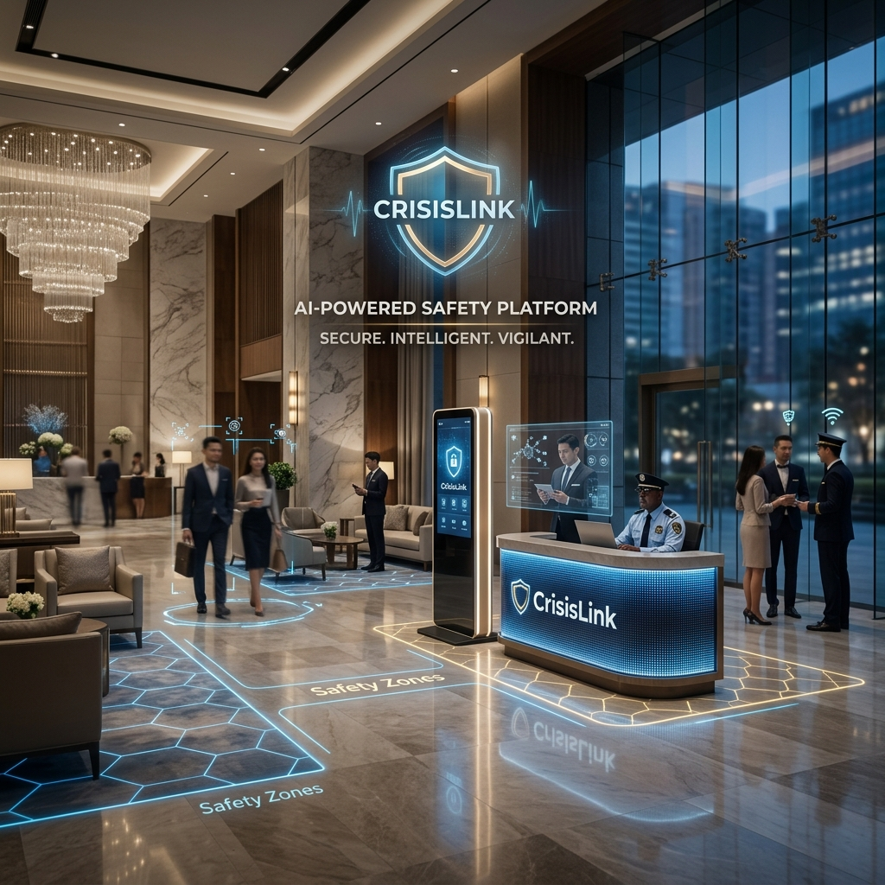
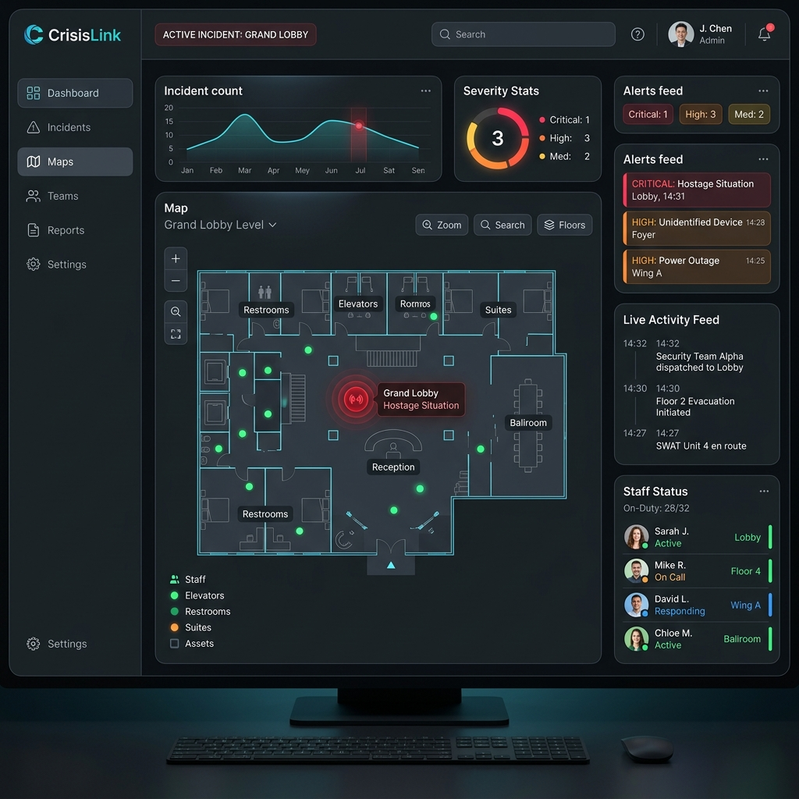
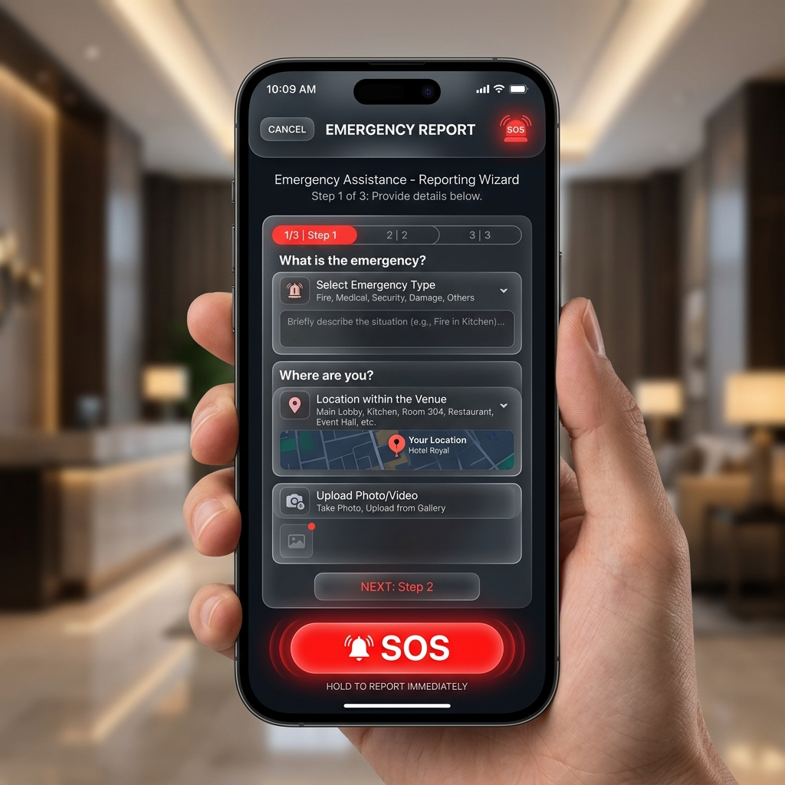

<div align="center">



# 🚨 CrisisLink — Rapid Crisis Response Platform



**Accelerated Emergency Response & Crisis Coordination in Hospitality**

[](https://nextjs.org/)
[](https://firebase.google.com/)
[](https://ai.google.dev/)
[](https://web.dev/progressive-web-apps/)
[](LICENSE)

> Deployed on **Google Cloud Platform (Cloud Run)** for scalable, real-time emergency coordination

[🌐 Live Demo](https://crisislink-3ekjm2mlba-uc.a.run.app) · [📖 Documentation](#getting-started) · [🐛 Report Bug](https://github.com/sanant456/CrisisLink/issues)

</div>

---

## 📌 Problem Statement

Hospitality venues face **unpredictable, high-stakes emergencies** that demand instantaneous, coordinated responses to protect lives and assets. Yet when crises occur, critical information becomes **siloed**—communication fractures between distressed guests, on-site staff, and emergency responders. This fragmentation delays response times, increases confusion, and puts lives at risk.

**CrisisLink** eliminates this breakdown. We bridge the gap between guests, staff, and first responders with real-time intelligence and AI-powered crisis coordination.

---

## 💡 Our Solution

**CrisisLink** is a real-time, web-based emergency coordination platform built for modern hospitality.



It provides:

- **Instant Guest Reporting** — Guests report emergencies in 3 steps via mobile, no login required, accessible via QR codes
- **AI-Powered Triage** — Gemini AI automatically classifies incident severity, suggests response protocols, and estimates response times
- **Command Center** — Crisis Managers monitor all incidents in real time with live dashboards, staff status, and activity feeds
- **Staff Mobile Portal** — On-site personnel receive instant alerts, manage assigned tasks, and check zone status
- **Real-Time Synchronization** — Firebase Firestore powers live data flow across all stakeholders simultaneously

<p align="center">
  
</p>

---

## ✨ Key Features

| Feature | Description |
|--------|-------------|
| 🚨 **Guest Reporting** | 3-step emergency wizard, no login needed, accessible via QR code |
| 🤖 **Gemini AI Analysis** | Multimodal triage using **Vertex AI** and **Vision AI** for visual hazard detection and severity classification |
| 📊 **Command Center** | Real-time dashboard with incidents, staff status & activity feed |
| 🗺️ **Venue Map** | Interactive floor plan with incident and staff location overlays |
| 👥 **Staff Management** | Directory with live status, search, filters, and assignment |
| 📈 **Analytics** | Incident trends, resolution rates, and performance metrics |
| 📱 **Staff Mobile Portal** | PWA-ready mobile view for on-ground staff |
| 🔒 **Role-Based Auth** | Firebase Authentication with Manager / Staff / Admin roles |
| 🌐 **PWA Support** | Installable as a native app on mobile devices |
| 🔁 **Demo Mode** | Works fully without any API keys using rich mock data |

---

## 🛠️ Tech Stack

| Layer | Technology |
|-------|-----------|
| **Framework** | Next.js 14 (App Router) |
| **Language** | JavaScript (React) |
| **Styling** | Vanilla CSS (CSS Modules + Design System) |
| **Auth** | Firebase Authentication (Email + Google Sign-In) |
| **Database** | Firebase Firestore (Real-time) |
| **Storage** | Firebase Storage |
| **AI** | Vertex AI (Gemini 1.5 Flash), Vision AI, Gemini 2.0 Flash |
| **PWA** | next-pwa (Service Workers) |
| **Font** | Outfit (Google Fonts) |

---

## 📂 Project Structure

```
crisislink/
├── public/
│   ├── manifest.json          # PWA manifest
│   └── icon.svg               # App icon
├── src/
│   ├── app/
│   │   ├── globals.css        # Global design system & tokens
│   │   ├── layout.js          # Root layout with AuthProvider
│   │   ├── page.js            # Landing page
│   │   ├── login/             # Authentication page
│   │   ├── report/            # Guest emergency report wizard
│   │   ├── staff/             # Mobile staff portal
│   │   └── dashboard/
│   │       ├── page.js        # Command center overview
│   │       ├── incidents/     # Incident management
│   │       ├── map/           # Venue floor plan
│   │       ├── staff/         # Staff directory
│   │       └── analytics/     # Analytics & reports
│   ├── components/
│   │   ├── Navbar.js          # Navigation bar
│   │   └── landing/           # Landing page sections
│   ├── context/
│   │   └── AuthContext.js     # Firebase Auth context & hooks
│   ├── hooks/
│   │   └── useRealtimeData.js # Real-time Firestore hooks
│   └── lib/
│       ├── firebase.js        # Firebase initialization
│       ├── firebaseConfig.js  # Firebase config (uses .env)
│       ├── firestoreService.js # Firestore CRUD operations
│       ├── geminiService.js   # Gemini AI integration
│       └── mockData.js        # Demo/fallback data
├── .env.example               # Environment variables template
└── next.config.mjs            # Next.js + PWA config
```

---

## 🚀 Getting Started

### Prerequisites

- Node.js 18+ installed ([Download here](https://nodejs.org/))
- A Google account (for Firebase & Gemini)

### 1. Clone the repository

```bash
git clone https://github.com/your-username/crisislink.git
cd crisislink
```

### 2. Install dependencies

```bash
npm install
```

### 3. Set up environment variables

```bash
cp .env.example .env.local
```

Open `.env.local` and fill in your API keys (see section below for how to get them):

```env
NEXT_PUBLIC_FIREBASE_API_KEY=your_key_here
NEXT_PUBLIC_FIREBASE_AUTH_DOMAIN=your_project.firebaseapp.com
NEXT_PUBLIC_FIREBASE_PROJECT_ID=your_project_id
NEXT_PUBLIC_FIREBASE_STORAGE_BUCKET=your_project.firebasestorage.app
NEXT_PUBLIC_FIREBASE_MESSAGING_SENDER_ID=your_sender_id
NEXT_PUBLIC_FIREBASE_APP_ID=your_app_id
NEXT_PUBLIC_GEMINI_API_KEY=your_gemini_key
```

> 💡 **Skipping this step?** No problem! The app will automatically run in **Demo Mode** with rich mock data. All features will still work for demonstration purposes.

### 4. Run the development server

```bash
npm run dev
```

Open [http://localhost:3000](http://localhost:3000) in your browser. 🎉

---

## 🔑 Getting API Keys

### Firebase (Free)
1. Go to [console.firebase.google.com](https://console.firebase.google.com/)
2. Click **"Add project"** → name it `crisislink`
3. Go to **Project Settings > General > Your apps > Web app**
4. Copy the config values into your `.env.local`
5. Enable **Firestore**, **Authentication** (Email + Google), and **Storage** in the Firebase console

### Gemini AI (Free tier available)
1. Go to [aistudio.google.com/apikey](https://aistudio.google.com/apikey)
2. Click **"Create API key"**
3. Paste it as `NEXT_PUBLIC_GEMINI_API_KEY` in your `.env.local`

---

## 📱 Pages & Routes

| Route | Page | Access |
|-------|------|--------|
| `/` | Landing Page | Public |
| `/report` | Guest Emergency Report | Public (QR Code) |
| `/login` | Staff/Manager Login | Public |
| `/dashboard` | Command Center Overview | Crisis Manager |
| `/dashboard/incidents` | Incident Management | Crisis Manager |
| `/dashboard/map` | Venue Floor Map | Crisis Manager |
| `/dashboard/staff` | Staff Directory | Crisis Manager |
| `/dashboard/analytics` | Analytics & Reports | Crisis Manager |
| `/staff` | Mobile Staff Portal | Staff |

---

## 🌐 Deployment

CrisisLink is deployed across two Google Cloud services for maximum performance:

### 1. Google Cloud Run (Full App)
The primary application is containerized and deployed to **Google Cloud Run** for high-performance server-side rendering and API handling.

1. **Build and Deploy via Script:**
   ```bash
   bash deploy.sh
   ```
2. The script builds the Docker image, pushes it to GCR, and deploys it to Cloud Run.

### 2. Firebase Hosting (Static Assets)
Static assets and the PWA bundle are optimized for delivery via **Firebase Hosting**.

1. Build the static export:
   ```bash
   npm run build
   ```
2. Deploy to Firebase:
   ```bash
   firebase deploy --only hosting
   ```
   
Your app will be live globally on a `.web.app` domain in seconds!

---

## 🎨 Design System

CrisisLink uses a custom dark-mode design system built in `globals.css`:

- **Font:** Outfit (Google Fonts) — modern, geometric, highly legible
- **Theme:** Dark glassmorphism with blue/purple accent palette
- **Colors:** Semantic crisis severity colors (critical → high → medium → low)
- **Components:** Buttons, Badges, Cards, Inputs — all reusable CSS classes
- **Animations:** Fade-in, slide, pulse, glow effects for high-stress UI clarity

---

## 🤝 Contributing

Contributions are welcome! Here's how to get started:

1. Fork this repository
2. Create your feature branch: `git checkout -b feature/AmazingFeature`
3. Commit your changes: `git commit -m 'Add some AmazingFeature'`
4. Push to the branch: `git push origin feature/AmazingFeature`
5. Open a Pull Request

---

## 📄 License

This project is licensed under the **MIT License** — see the [LICENSE](LICENSE) file for details.

---

## 🙏 Acknowledgements

- Google Solution Challenge 2026
- [Next.js](https://nextjs.org/) — The React framework
- [Firebase](https://firebase.google.com/) — Backend & real-time database
- [Google Gemini AI](https://ai.google.dev/) — AI-powered incident analysis
- [Firebase Hosting](https://firebase.google.com/docs/hosting) — Deployment platform

---

<div align="center">

Made with ❤️ for the **Google Solution Challenge 2026**

**⭐ Star this repo if you found it helpful!**

</div>
